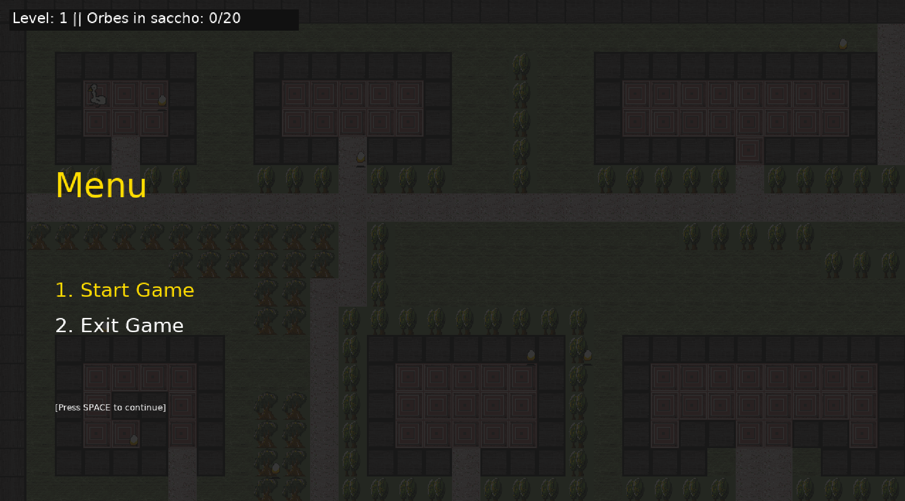
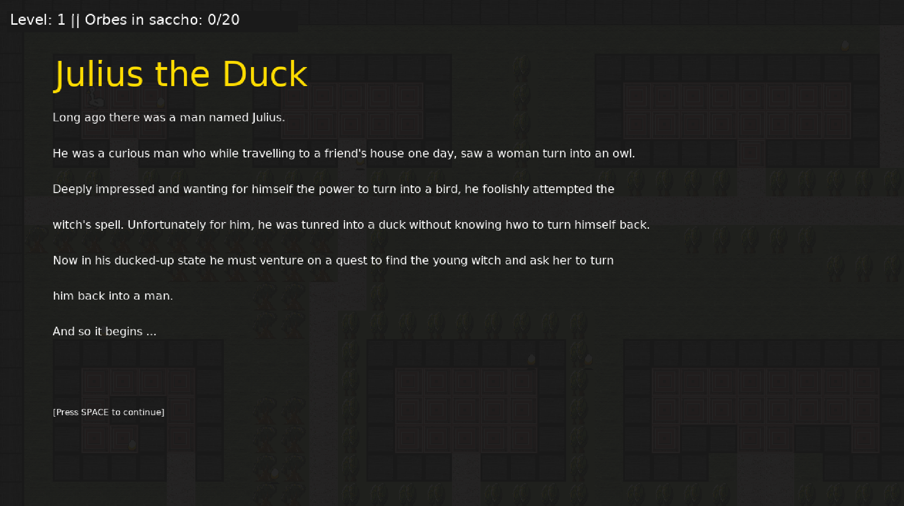
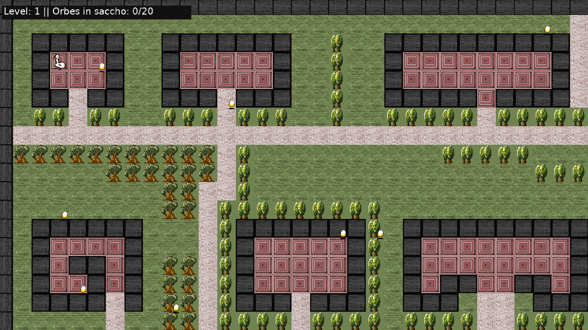

# Verborum Iter
#### A simple open-world game built using Ruby 2D





## 1. Setup and Dependencies
1. Ruby
  Check ruby version:
  ```bash
  ruby --version
  ```

  If no, install ruby (or whatever the machine you use requires):
  ```bash
  sudo apt-get install ruby-full
  ```

2. Ruby 2D dependencies/packages (only Linux)
  Ubuntu, Debian, and Mint:
  ```bash
  sudo apt install libsdl2-dev libsdl2-image-dev libsdl2-mixer-dev libsdl2-ttf-dev
  ```
  Fedora:
  ```bash
  sudo yum install SDL2-devel SDL2_image-devel SDL2_mixer-devel SDL2_ttf-devel
  ```
  For other distros, check out the [docs](https://www.ruby2d.com/learn/get-started/).

3. Ruby 2D (or whatever the machine you use requires):
  ```bash
  gem install ruby2d
  ```
## 2. Clone the repo:
  ```bash
  gh repo clone virfortis-rgb/vi
  ```

## 3. Play and enjoy ... or just look at the code and get on with your life
  ```bash
  ruby main.rb
  ```
## 4. Export to an executable
  ```
  Currently looking into this. Any suggestions are welcome 
  ```
